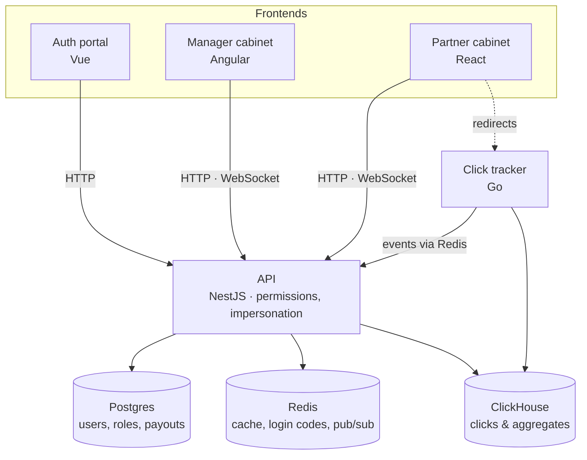

# Julia

A demo affiliate-marketing platform built as a single Nx monorepo, showcasing a role-based permissions system (CASL) and manager-into-partner account impersonation as its core feature. Built in public, stage by stage — see [status](#status) below.

> 📄 Full implementation plan: [`doc/Affiliate Platform Portfolio — план реалізації.pdf`](doc/Affiliate%20Platform%20Portfolio%20—%20план%20реалізації.pdf)

## What it is

Account managers manage a portfolio of affiliate partners: approving them, assigning offers, approving payouts, and — when needed — logging into a partner's own dashboard to see exactly what they see. Who can do what is driven by a permission system managers configure themselves, not hardcoded roles. Partners track their offers, generate tracking links, and watch clicks turn into conversions and payouts in real time.

## Architecture

One Nx monorepo: three frontends, two backends, three data stores.



Frontends talk to the NestJS API. The Go tracker takes click traffic off the API's hands: it writes clicks straight to ClickHouse and forwards events to the API through Redis; the API reads aggregates back from ClickHouse for the dashboards.

## Why this stack

- **Nx monorepo** — three frontends and two backends share contracts, a permissions model, and design tokens without publishing internal packages.
- **NestJS** — structured, DI-driven home for auth, permissions, and business modules.
- **Angular** (manager cabinet) / **React** (partner cabinet) — two different frontend paradigms in one repo, on purpose, to show range.
- **Vue** (auth portal) — a third, isolated entry point so login/signup never has to live inside either cabinet's bundle.
- **CASL** — one `defineAbilityFor(user)` ability factory shared between the API and both cabinets, instead of re-implementing permission checks per layer.
- **Go** (click tracker) — the one high-throughput path (click redirects) gets a language built for concurrency instead of competing with the API's event loop.
- **ClickHouse** — clicks and conversions are an append-heavy time series; a columnar store aggregates them far faster than Postgres at volume.
- **Postgres** — everything transactional and relational (users, roles, payouts, audit log) stays in a normal relational database.
- **Redis** — cache, one-time login/impersonation codes, and the pub/sub bridge between the Go tracker and the API.
- **Biome** — a single tool for linting and formatting the whole TS/JS codebase instead of maintaining separate ESLint and Prettier configs.

## Permissions & impersonation

The core feature, built right after auth and before any business module:

- Permissions are `resource:action` strings (`offers:read`, `partners:impersonate`, `payouts:approve`, …) assigned to roles, evaluated through a single CASL ability factory shared by the API and both cabinets.
- Data-level rules apply on top — e.g. an account manager only ever sees their own assigned partners.
- A manager with `partners:impersonate` can open one of their partners' dashboards directly. The exchange uses a short-lived, one-time Redis code (never a token in a URL); the resulting session is clearly marked, time-boxed, and blocked from sensitive actions (password/email/payout-details changes). Every action taken during an impersonated session is audit-logged against both the partner and the manager.

## Status

| Stage | Adds | Release | Status |
| --- | --- | --- | --- |
| 0 | Nx workspace, tooling, design tokens, CI | — | 🚧 in progress |
| 1 | MVP: auth, permissions, impersonation, both cabinets, deploy | `v0.1` | ⬜ planned |
| 2 | Go tracker, ClickHouse, Vue auth portal, load testing | `v0.2` | ⬜ planned |
| 3 | WebSockets: notifications, live stats | `v0.3` | ⬜ planned |

Currently in Stage 0: the Nx workspace is scaffolded and tool-chained (pnpm, Biome, Vitest), and the three Stage 1 apps are generated — `apps/api` (NestJS), `apps/manager-web` (Angular), `apps/partner-web` (React) — but still empty shells with no auth, permissions, or business logic yet. No shared libraries, database, or CI pipeline yet either.

## Tooling

- **Package manager:** pnpm (pinned via `packageManager` in `package.json`)
- **Monorepo:** [Nx](https://nx.dev)
- **Lint & format:** [Biome](https://biomejs.dev) — `pnpm lint`, `pnpm format`
- **Tests:** [Vitest](https://vitest.dev) (unit), [Playwright](https://playwright.dev) (e2e)

## Quick start

```sh
pnpm install
pnpm lint
pnpm nx run-many -t build test
```

Run a single app in dev mode with `pnpm nx serve api`, `pnpm nx serve manager-web`, or `pnpm nx serve partner-web` — there's nothing behind them yet beyond the Nx-generated starter page. `docker compose up` and seeded data land with the database in Stage 1.
